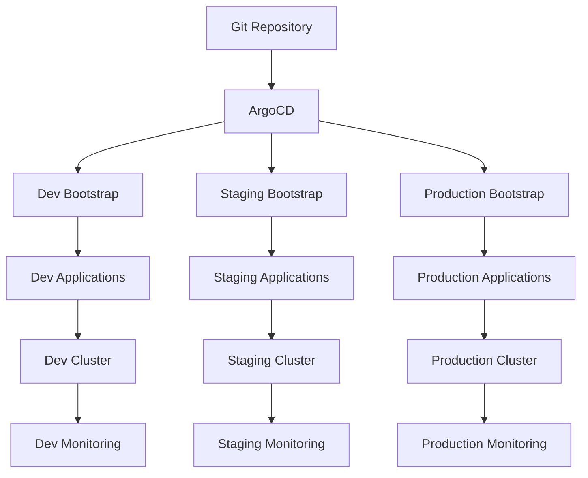

# GitOps with ArgoCD

This directory contains a complete GitOps setup for managing your EKS cluster using ArgoCD. This approach replaces the shell script-based addon management with a declarative, version-controlled, and automated system.

## 🚀 Quick Start

### 1. Bootstrap ArgoCD and Applications

```bash
# Bootstrap ArgoCD for development
make gitops-bootstrap-dev

# Bootstrap ArgoCD for staging
make gitops-bootstrap-staging

# Bootstrap ArgoCD for production
make gitops-bootstrap-prod

# Or bootstrap for current environment (default: production)
make gitops-bootstrap

# Bootstrap with UI access (includes port-forward)
make gitops-bootstrap-ui
```

### 2. Access ArgoCD UI

```bash
# Get admin password
make argocd-password

# Start port-forward to UI
make argocd-ui
```

Then open: https://localhost:8080
- **Username**: `admin`
- **Password**: (from the command above)

### 3. Monitor Applications

```bash
# List all applications
make argocd-apps

# Check status for specific environments
make gitops-status-dev
make gitops-status-staging
make gitops-status-prod

# Or check current environment
make gitops-status

# View logs
make argocd-logs
```

## 📁 Directory Structure

```
gitops/
├── argocd/                    # ArgoCD installation and configuration
│   ├── namespace.yaml         # ArgoCD namespace
│   ├── install.yaml           # ArgoCD configuration (ingress, RBAC, etc.)
│   └── bootstrap-app.yaml     # Bootstrap application (legacy)
├── applications/              # Base ArgoCD Application manifests
│   ├── aws-load-balancer-controller.yaml
│   ├── cluster-autoscaler.yaml
│   ├── monitoring.yaml
│   ├── ingress-nginx.yaml
│   ├── external-dns.yaml
│   └── cert-manager.yaml
├── environments/              # Environment-specific configurations
│   ├── dev/
│   │   ├── kustomization.yaml
│   │   ├── bootstrap-dev.yaml
│   │   └── patches/           # Environment-specific patches
│   │       ├── monitoring-patch.yaml
│   │       ├── cluster-autoscaler-patch.yaml
│   │       └── aws-load-balancer-controller-patch.yaml
│   ├── staging/
│   │   ├── kustomization.yaml
│   │   ├── bootstrap-staging.yaml
│   │   └── patches/
│   │       ├── monitoring-patch.yaml
│   │       └── cluster-autoscaler-patch.yaml
│   └── production/
│       ├── kustomization.yaml
│       └── bootstrap-production.yaml
├── values/                    # Helm values for applications (future use)
├── bootstrap.sh              # Multi-environment bootstrap script
└── README.md                 # This file
```

## 🔄 How It Works

### App of Apps Pattern

The GitOps setup uses the "App of Apps" pattern with multi-environment support:

1. **Bootstrap Application**: Environment-specific, manages all applications for that environment
2. **Individual Applications**: Each addon is a separate ArgoCD Application
3. **Environment Patches**: Kustomize patches for environment-specific configurations
4. **Automatic Sync**: ArgoCD monitors Git repository and auto-syncs changes
5. **Self-Healing**: Automatically fixes configuration drift

### Multi-Environment Architecture



### Environment-Specific Configurations

- **Dev**: Smaller resources, faster scaling, single replicas
- **Staging**: Production-like but with moderate resources
- **Production**: Full resources, high availability, multiple replicas

## 🎯 Why GitOps for Dev/Test Too?

### The Problem with Mixed Approaches

Many teams use shell scripts for dev/test and GitOps for production, but this creates:

- **Environment Drift**: Dev/test environments don't match production
- **Learning Overhead**: Developers need to understand both approaches
- **Debugging Complexity**: Issues only appear in production due to different deployment methods
- **Inconsistent Workflows**: Different processes for different environments

### GitOps Everywhere Benefits

| **Aspect** | **Shell Scripts (Dev/Test)** | **GitOps (All Environments)** |
|------------|------------------------------|-------------------------------|
| **Consistency** | ❌ Different from production | ✅ Identical across environments |
| **Parity** | ❌ Environment drift likely | ✅ Perfect environment parity |
| **Collaboration** | ❌ Individual scripts | ✅ Git workflow for all |
| **Learning** | ❌ Multiple approaches | ✅ One production-ready approach |
| **Debugging** | ❌ Environment-specific issues | ✅ Issues caught early |
| **Rollbacks** | ❌ Manual, error-prone | ✅ Git-based, instant |
| **Audit** | ❌ Limited in dev/test | ✅ Complete history everywhere |
| **Cost** | ❌ Resource waste | ✅ Environment-optimized resources |

### Environment-Specific Optimizations

- **Dev**: Smaller resources, faster scaling, cost-optimized
- **Staging**: Production-like validation with moderate resources
- **Production**: Full resources, high availability, enterprise-grade

## 🛠️ Applications Included

| Application | Description | Namespace | Chart |
|-------------|-------------|-----------|-------|
| **AWS Load Balancer Controller** | Manages AWS ALB/NLB | `kube-system` | `eks/aws-load-balancer-controller` |
| **Cluster Autoscaler** | Automatically scales nodes | `kube-system` | `autoscaler/cluster-autoscaler` |
| **Monitoring Stack** | Prometheus + Grafana | `monitoring` | `prometheus-community/kube-prometheus-stack` |
| **NGINX Ingress** | Ingress controller | `ingress-nginx` | `ingress-nginx/ingress-nginx` |
| **External DNS** | Route53 DNS management | `external-dns` | `external-dns/external-dns` |
| **Cert Manager** | SSL/TLS certificates | `cert-manager` | `jetstack/cert-manager` |

## ⚙️ Configuration

### Before You Start

1. **Update Repository URL** in `gitops/argocd/bootstrap-app.yaml`:
   ```yaml
   spec:
     source:
       repoURL: https://github.com/YOUR_USERNAME/eks-cloudformation.git
   ```

2. **Configure Applications** for your environment:
   ```bash
   # Update cluster name, region, domain
   make gitops-update-configs
   ```

### Environment Variables

Set these in the bootstrap script or as environment variables:

```bash
export CLUSTER_NAME="your-cluster-name"
export REGION="ap-southeast-2"
export DOMAIN="your-domain.com"
export EMAIL="admin@your-domain.com"
export REPO_URL="https://github.com/YOUR_USERNAME/eks-cloudformation.git"
```

### IAM Roles Required

Each application needs an IAM role with appropriate permissions:

```bash
# AWS Load Balancer Controller
AmazonEKSLoadBalancerControllerRole

# Cluster Autoscaler
AmazonEKSClusterAutoscalerRole

# External DNS
AmazonEKSExternalDNSRole

# Cert Manager
AmazonEKSCertManagerRole
```

## 📝 Usage Examples

### Individual Application Management

```bash
# Sync specific application
kubectl patch application aws-load-balancer-controller -n argocd --type merge -p '{"spec":{"syncPolicy":{"automated":{"prune":true,"selfHeal":true}}}}'

# Disable auto-sync for an application
kubectl patch application monitoring -n argocd --type merge -p '{"spec":{"syncPolicy":{"automated":null}}}'

# Manual sync
kubectl patch application cert-manager -n argocd --type merge -p '{"spec":{"operation":{"sync":{}}}}'
```

### Application Status

```bash
# Check application health
kubectl get applications -n argocd

# Get detailed status
kubectl describe application monitoring -n argocd

# View sync history
kubectl get application monitoring -n argocd -o jsonpath='{.status.history}'
```

### Troubleshooting

```bash
# View ArgoCD logs
make argocd-logs

# Check application events
kubectl get events -n argocd

# Check application-specific logs
kubectl logs -n monitoring deployment/prometheus-operator-kube-p-operator

# Force refresh
kubectl patch application aws-load-balancer-controller -n argocd --type merge -p '{"spec":{"source":{"targetRevision":"HEAD"}}}'
```

## 🔧 Advanced Configuration

### Custom Values

To customize an application, edit the `values` section in its Application manifest:

```yaml
# gitops/applications/monitoring.yaml
spec:
  source:
    helm:
      values: |
        prometheus:
          prometheusSpec:
            retention: 30d
            storageSpec:
              volumeClaimTemplate:
                spec:
                  storageClassName: gp3
                  resources:
                    requests:
                      storage: 100Gi
```

### Multi-Environment Support

Create environment-specific applications:

```bash
# Development applications
cp -r gitops/applications gitops/applications-dev

# Update namespace and values for dev
sed -i 's/namespace: monitoring/namespace: monitoring-dev/g' gitops/applications-dev/*.yaml
```

### Secrets Management

For sensitive data, use Kubernetes secrets:

```bash
# Create secret for Grafana admin password
kubectl create secret generic grafana-admin-secret -n monitoring \
  --from-literal=admin-user=admin \
  --from-literal=admin-password=your-secure-password
```

## 🚨 Troubleshooting

### Common Issues

1. **Application Stuck in Sync**
   ```bash
   # Check sync status
   kubectl get application APP_NAME -n argocd -o jsonpath='{.status.sync.status}'
   
   # Force refresh
   kubectl patch application APP_NAME -n argocd --type merge -p '{"spec":{"source":{"targetRevision":"HEAD"}}}'
   ```

2. **Health Check Failures**
   ```bash
   # Check application health
   kubectl get application APP_NAME -n argocd -o jsonpath='{.status.health.status}'
   
   # View health details
   kubectl describe application APP_NAME -n argocd
   ```

3. **Permission Issues**
   ```bash
   # Check service account annotations
   kubectl get serviceaccount SERVICE_ACCOUNT -n NAMESPACE -o yaml
   
   # Verify IAM role trust relationship
   aws iam get-role --role-name ROLE_NAME
   ```

### Debug Commands

```bash
# ArgoCD server logs
kubectl logs -n argocd deployment/argocd-server

# Application controller logs
kubectl logs -n argocd deployment/argocd-application-controller

# Repository server logs
kubectl logs -n argocd deployment/argocd-repo-server

# Check resource usage
kubectl top pods -n argocd
```

## 🔄 Migration from Shell Scripts

If you're migrating from the shell script approach:

1. **Uninstall existing addons** (if needed):
   ```bash
   # Remove existing installations
   helm uninstall aws-load-balancer-controller -n kube-system
   helm uninstall cluster-autoscaler -n kube-system
   # ... etc
   ```

2. **Bootstrap GitOps**:
   ```bash
   make gitops-bootstrap
   ```

3. **Monitor migration**:
   ```bash
   make gitops-status
   ```

## 📚 Additional Resources

- [ArgoCD Documentation](https://argo-cd.readthedocs.io/)
- [GitOps Best Practices](https://www.weave.works/technologies/gitops/)
- [Kubernetes Application Management](https://kubernetes.io/docs/concepts/extend-kubernetes/api-extension/)
- [Helm Charts](https://helm.sh/docs/topics/charts/)

## 🔒 Security Considerations

1. **RBAC**: Each application has minimal required permissions
2. **Network Policies**: Consider implementing network policies
3. **Pod Security Standards**: Applications configured with security contexts
4. **Secrets**: Use Kubernetes secrets for sensitive data
5. **Image Security**: Use trusted registries and scan images

## 📈 Monitoring and Observability

The GitOps setup includes comprehensive monitoring:

- **Prometheus**: Metrics collection
- **Grafana**: Dashboards and visualization
- **AlertManager**: Alert management
- **ServiceMonitors**: Application-specific metrics
- **PodMonitors**: Pod-level monitoring

Access monitoring:
```bash
# Grafana UI
kubectl port-forward -n monitoring svc/prometheus-grafana 3000:80

# Prometheus UI
kubectl port-forward -n monitoring svc/prometheus-operated 9090:9090
```

## 🎯 Best Practices

1. **Version Control**: All changes through Git
2. **Testing**: Test changes in development first
3. **Rollback**: Use Git history for rollbacks
4. **Documentation**: Keep this README updated
5. **Monitoring**: Monitor application health regularly
6. **Security**: Regular security updates and scans
7. **Backup**: Regular etcd and application backups

---

**Happy GitOps-ing!** 🚀 